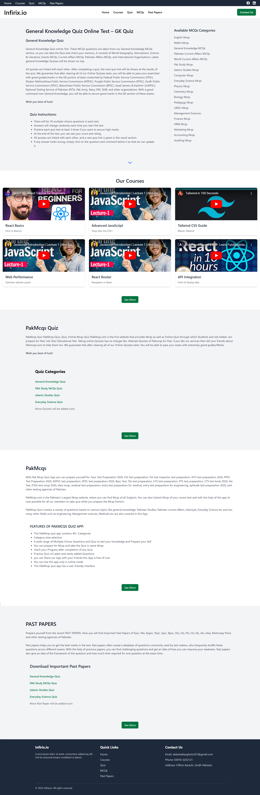

# PakMcqs Quiz App

[](https://reactjs.org/)
[](https://tailwindcss.com/)

Welcome to **PakMcqs Quiz App**! This React-based web application is designed to help students and job seekers prepare for various competitive exams in Pakistan. Enjoy interactive quizzes, engaging video courses, extensive MCQs, and downloadable past exam papers—all with a modern, responsive interface.

---

## Table of Contents

- [✨ Features](#-features)
- [🚀 Demo](#-demo)
- [📸 Screenshots](#-screenshots)
- [⚙️ Installation](#-installation)
- [💻 Usage](#-usage)
- [🗂 File Structure](#-file-structure)
- [🛠 Technologies Used](#-technologies-used)
- [🤝 Contributing](#-contributing)
- [📝 License](#-license)
- [📞 Contact](#-contact)

---

## ✨ Features

- **Home Page** 🏠  
  Overview, quiz instructions, and available MCQ categories.
- **Courses** 📹  
  Video courses on React, JavaScript, Tailwind CSS, and more.
- **Quiz** ❓  
  Interactive quizzes to test your knowledge and track progress.
- **MCQs** 📝  
  Extensive practice questions across multiple subjects.
- **Past Papers** 📂  
  Downloadable PDFs of important past exam papers.
- **Responsive Design** 📱  
  Optimized for all devices using Tailwind CSS.

---


## 📸 Screenshots


  
  

---
## ⚙️ Installation

Follow these steps to set up the project locally:

1. **Clone the Repository:**

   ```bash
   https://github.com/absattarghoto/mcqs_website.git
